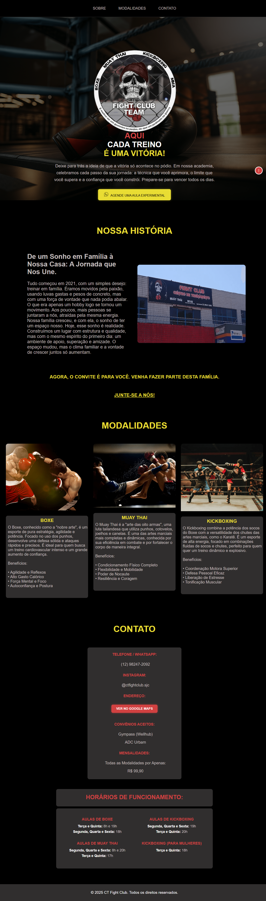

<div align="center">
  
</div>

<div align="center">
  <h1>Kombat Zone Academy</h1>
  <h2>Projeto de Landing Page</h2>
</div>

> Uma landing page responsiva desenvolvida para uma academia de artes marciais.

<br>

<h2>
  📜 Sobre o Projeto
</h2>

<p>
  Landing Page desenvolvida para o CT Fight Club, um cliente real em São José dos Campos/SP. O projeto foi concebido durante o curso de Ciência da Computação na Anhanguera, 
  servindo como um desafio prático para aplicar conceitos de engenharia de software e design responsivo. Foi uma oportunidade para aprimorar minhas habilidades em desenvolvimento 
  front-end e entregar uma solução de mercado.
</p>

  **Observação:** O código neste repositório foi adaptado com informações fictícias para demonstração pública em meu portfólio.<br>
  **Link para o Site real:** https://www.ctfightclub.site

<br>

<h2>
  ✨ Funcionalidades
</h2>

* **Responsividade:** Layout totalmente adaptado a desktops, tablets e smartphones.
* **Navegação Intuitiva:** Menu de navegação claro e um botão "Voltar ao Topo" para uma experiência de usuário fluida.
*   **Seções Informativas:**
    *   **Sobre:** Conta a história da academia, criando uma conexão com o visitante.
    *   **Modalidades:** Apresenta as artes marciais oferecidas com descrições e benefícios.
    *   **Contato e Horários:** Centraliza todas as informações práticas...

*   **Call-to-Action (CTA):** Botões estrategicamente posicionados para incentivar o agendamento de aulas experimentais via WhatsApp, focando na conversão de visitantes em leads.

<br>

<h2>
  🛠️ Tecnologias Utilizadas
</h2>
<p>
  Este projeto foi construído com as seguintes tecnologias:
</p>
<br>
<div>
  
  
  
  
  
  
</div>
<br>

*   **HTML5:** Para a estrutura e semântica do conteúdo.
*   **CSS3:** Para estilização, layout e animações.
*   **JavaScript:** Para interatividade e manipulação do DOM.
*   **Git e GitHub:** Para versionamento de código e hospedagem.

<br>

<h2>
  
Prints do Site Real
</h2>

* **Versão Desktop:**

| Prévia do Projeto |
| :---: |
|  |


* **Versão Mobile:**

| Prévia do Projeto |
| :---: |
|  |

<br>

<h2>
  🚀 Como Executar o Projeto
</h2>

Para visualizar o projeto localmente, siga os passos abaixo:

1.  **Clone o repositório:**
    ```bash
    git clone https://github.com/vitorf2003/kombatzoneacademy-landingpage.git
    ```

2.  **Navegue até a pasta do projeto:**
    ```bash
    cd kombatzoneacademy-landingpage
    ```

3.  **Abra o arquivo `index.html` no seu navegador de preferência.**

E pronto! Você já pode explorar o site.

---
<br>

## ✒️ Autor

Feito por **Vitor Faria**.

*   **LinkedIn:** [Vitor Faria](https://www.linkedin.com/in/vitor-faria-3865321b5)
*   **GitHub:** [@vitorf2003](https://github.com/vitorf2003)
